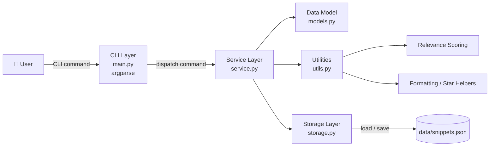
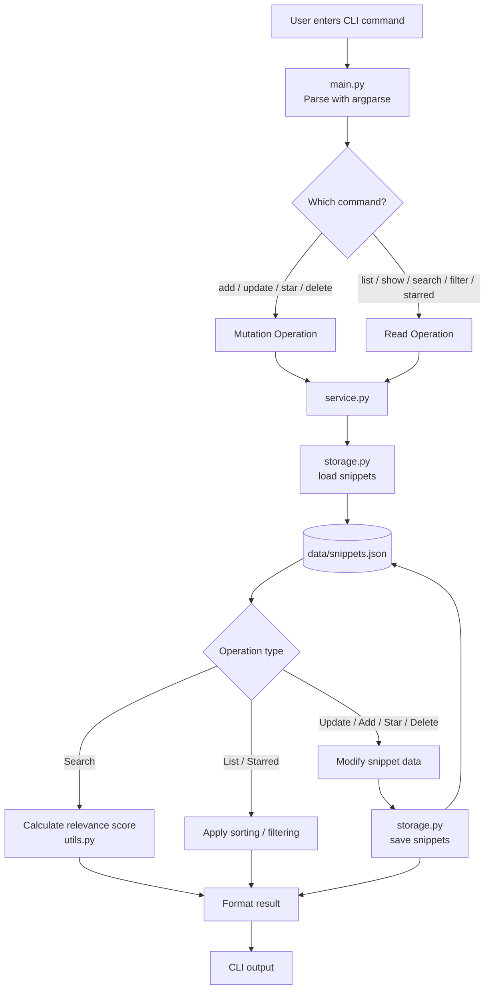
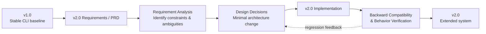

# Spec-Driven Snippet Manager

A lightweight Python CLI knowledge manager that demonstrates how a stable v1.0 system can evolve into v2.0 through **spec-driven development**, while preserving backward compatibility and avoiding unnecessary architectural rewrites.

Built with Python, `argparse`, modular service/storage layers, and local JSON persistence.

---

## ✨ Key Features

### v1.0
- Add knowledge snippets
- List all snippets
- Show a snippet by ID
- Search snippets by keyword
- Filter snippets by tag
- Delete snippets
- Local JSON persistence
- Stable CLI behavior

### v2.0
- Partial snippet updates
- Relevance-ranked search
- Star / unstar important snippets
- List starred snippets
- Sort snippets by updated time
- Persistent metadata using `metadata.starred`
- Backward-compatible evolution from v1.0

---

## 📌 Overview

The **Knowledge Snippet Manager** is a lightweight command-line application for storing and retrieving short notes.

The project was first implemented as a stable v1.0 baseline and later evolved into v2.0 using a spec-driven development process.

Rather than rewriting the application, v2.0 extends the existing architecture while preserving the original CLI contract as much as possible.

The main goal of this project is not application complexity. Instead, it demonstrates how software can evolve from new requirements while minimizing architectural disruption.

---

## Architecture

The project follows a simple layered architecture.

- `main.py` handles CLI parsing and command dispatch.
- `service.py` contains application and business logic.
- `storage.py` manages JSON persistence.
- `models.py` defines the snippet data model.
- `utils.py` contains shared helpers such as formatting, timestamps, star-state handling, and relevance scoring.



This structure keeps CLI concerns, business behavior, data representation, and persistence separated.

---

## Command Workflow

Every CLI command follows the same high-level execution path:

1. Parse the command and arguments.
2. Dispatch the request to the service layer.
3. Load current snippet data.
4. Apply the requested operation.
5. Save changes when needed.
6. Format the result for CLI output.



---

## Quick Start

### Requirements

- Python 3.11+
- No third-party dependencies are required
- Local JSON storage under `data/snippets.json`

### Clone the repository

```bash
git clone https://github.com/hsin0616/Spec-Driven-Snippet-Manager.git
cd Spec-Driven-Snippet-Manager
```

### Run v1.0

```bash
cd v1
python main.py --help
```

### Run v2.0

```bash
cd v2
python main.py --help
```

---

## 💻 Example Usage

### Add a snippet

```bash
python main.py add \
  --title "Python Basics" \
  --content "Decorator and list comprehension" \
  --tags "python,programming"
```

### List snippets

```bash
python main.py list
```

### Update a snippet

```bash
python main.py update --id 1 --title "Python Fundamentals"
```

### Search with relevance ranking

```bash
python main.py search --query "python" --sort relevance
```

### Star a snippet

```bash
python main.py star --id 1
```

### Show starred snippets

```bash
python main.py starred
```

### Sort by updated time

```bash
python main.py list --sort updated
```

---

## 📁 Project Structure

```text
Spec-Driven-Snippet-Manager/
├── v1/
│   ├── main.py
│   ├── service.py
│   ├── storage.py
│   ├── models.py
│   └── utils.py
│
├── v2/
│   ├── main.py
│   ├── service.py
│   ├── storage.py
│   ├── models.py
│   ├── utils.py
│   └── data/
│       └── snippets.json
│
└── README.md
```

| Module | Responsibility |
|---|---|
| `main.py` | CLI parsing and command dispatch |
| `service.py` | Application and business logic |
| `storage.py` | JSON loading, saving, and ID handling |
| `models.py` | Snippet data model |
| `utils.py` | Formatting, timestamps, star helpers, and relevance scoring |

---

## v1.0 → v2.0 Evolution

The v2.0 requirements were treated as a **feature extension on top of a stable baseline**, not as a reason to rewrite the application.

The main user pain points were:

- snippets could not be revised after creation,
- search results were not ranked,
- important snippets could not be marked,
- list results could not be reordered.

v2.0 addresses these problems with four main capabilities:

- `update` for partial edits,
- `search --sort relevance` for ranking,
- `star` / `starred` for important-note management,
- `list --sort updated` for update-time ordering.

### Architecture comparison

| Dimension | v1.0 | v2.0 |
|---|---|---|
| Storage layer | JSON file | JSON file |
| CLI library | `argparse` | `argparse` |
| Core modules | `main.py`, `service.py`, `storage.py`, `models.py`, `utils.py` | Same five modules |
| Data extensibility | `metadata` reserved but unused | `metadata.starred` used for persistent extension |
| Search order | Insertion order only | Insertion order or relevance ranking |
| List order | Insertion order only | Insertion order or updated-time order |
| Note revision | Not supported | Partial update supported |
| Important-note marking | Not supported | `star` / `starred` supported |
| Verification | Basic feature testing | Backward-compatibility + new-feature testing |

### Spec-driven evolution workflow



The important result is that v2.0 adds new capability without replacing the original architectural boundaries.

---

## Design Decisions

### Why `argparse`

`argparse` was chosen because it is part of the Python standard library, reliable in a clean environment, and sufficient for a command-driven application.

It also supports additive evolution naturally: new subcommands and optional arguments can be introduced without replacing the existing CLI structure.

### Why a separate service layer

Business behavior belongs in `service.py` rather than directly inside the CLI entry point.

This allowed v2.0 to add behavior such as:

- `update_snippet()`
- `star_snippet()`
- `list_starred_snippets()`
- sorting in `list_snippets()`
- relevance ranking in `search_snippets()`

without turning `main.py` into a large data-manipulation script.

### Why storage logic is isolated

Loading, saving, and next-ID calculation are kept in `storage.py`.

This keeps file I/O separate from application behavior and makes future storage replacement easier.

### Why JSON storage was preserved

A database such as SQLite would be more scalable, but it was unnecessary for the current project requirements.

JSON was intentionally preserved because it is:

- transparent,
- easy to inspect,
- dependency-free,
- easy to run in a clean environment,
- sufficient for the project scale.

Avoiding an unnecessary storage migration also keeps the architectural diff between v1.0 and v2.0 small.

### Why `metadata` was reserved early

The snippet model already included a `metadata` field in v1.0.

In v2.0, the starred state is stored as:

```text
metadata["starred"]
```

This avoids introducing a breaking top-level schema change and leaves room for future auxiliary state such as:

- `pinned`
- `archived`
- `priority`
- review status

### Why output format is treated as a contract

User-visible CLI output is part of the observable behavior of the program.

Messages such as:

```text
Added:
Deleted:
No snippets found
Error: snippet not found
```

were therefore treated as interface behavior rather than arbitrary text.

This became important when implementing v2.0 because the new features needed to coexist with backward-compatibility requirements.

### Why default insertion order was preserved

The original v1.0 behavior uses insertion order.

v2.0 preserves this default unless the user explicitly requests another sorting mode. This keeps the old mental model intact.

---

## Important v2.0 Implementation Choices

### Partial updates

The `update` command modifies only the fields explicitly provided by the user.

A successful content update refreshes `updated_at`.

Calling update without any fields is treated as an error.

### Explainable relevance scoring

Search relevance uses a transparent scoring rule:

- title hit = `3`
- content hit = `1`

This avoids introducing a black-box ranking algorithm for a small CLI project.

For equal relevance scores, stable ordering is preserved.

### Star state in metadata

The starred state is stored in:

```text
metadata.starred
```

rather than as a new top-level model field.

This keeps the core model stable while providing an extension point for future metadata.

### Star does not update `updated_at`

`updated_at` represents content edits rather than metadata toggles.

If starring changed `updated_at`, `list --sort updated` would mix content revisions with metadata operations and become less meaningful.

### Separate legacy and starred-aware formatting

The project keeps legacy-compatible summary output separate from starred-aware output.

This allows the application to display `★` where the new feature requires it without spreading visible changes across every old command.

---

## Backward Compatibility

The main implementation rule for v2.0 was:

> Add new capability through new commands or optional arguments, while keeping existing behavior stable unless the new specification explicitly requires a visible change.

The compatibility strategy is:

- `add` remains unchanged,
- `show` remains unchanged,
- `search` remains unchanged unless `--sort relevance` is requested,
- `filter` remains unchanged,
- `delete` remains unchanged,
- `list` keeps the same base behavior while adding the smallest visible starred marker needed by the new feature.

### Requirement tension

One requirement asks starred snippets to be visually recognizable in `list`, while another asks old commands to remain unchanged when new optional parameters are not used.

These two goals conflict slightly because `list` is both an existing command and the place where the new feature must become visible.

The chosen compromise is:

- `list` and `starred` may display `★`,
- `show` does not add a starred line,
- `search` and `filter` preserve the original v1.0 summary format.

This keeps the visible behavior change as small as possible.

---

## Verification Strategy

The project was verified through CLI behavior checks based directly on the intended requirements.

The checks include:

- `add`, `list`, `show`, `search`, `filter`, and `delete` still work,
- partial updates work,
- `updated_at` is refreshed after content updates,
- update without fields fails with a non-zero exit,
- list sorting by updated time works,
- relevance sorting works,
- star toggling works,
- starred state persists after restarting the program,
- invalid IDs produce errors,
- invalid sort values produce errors.

For this CLI project, user-visible behavior is treated as the primary contract.

---

## ⚠️ Known Limitations

### File-based storage

JSON works well for this project scale, but it is not ideal for:

- large datasets,
- concurrent access,
- advanced querying,
- transactional behavior.

### Simple search

The relevance system is intentionally transparent and lightweight.

It does not currently support:

- stemming,
- fuzzy search,
- synonyms,
- semantic search,
- tag-aware ranking.

### No automated test suite

The current implementation relies on manual CLI verification.

A production-style version should include automated regression tests.

### No migration tool

Because the v2.0 JSON representation remains compatible with v1.0, no migration script was required.

A future breaking schema change would likely need one.

---

## Future Improvements

Possible v3.0 improvements include:

- automated tests with `unittest` or `pytest`,
- SQLite-backed storage,
- fuzzy or semantic search,
- tag-aware relevance ranking,
- additional metadata such as `archived`, `priority`, or review scheduling,
- import / export support,
- batch operations,
- richer CLI table formatting.

The main design principle remains the same:

> A good baseline is not the version with the most features. It is the version whose design makes future change safe.

---

## Main Takeaway

This project demonstrates that spec-driven development is not only about implementing features from a requirement document.

The harder part is translating product requirements into technical decisions that are:

- precise,
- compatible,
- maintainable,
- easy to verify,
- small enough to avoid unnecessary redesign.

The v2.0 implementation therefore stays intentionally close to the v1.0 architecture while still solving the new product requirements.
