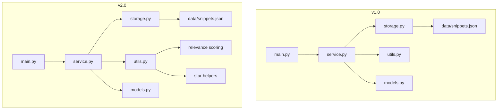

# Spec-Driven Development — From v1.0 to v2.0

**Student:** Hsin-En Tsai  
**Course:** Generative AI Application Systems and Engineering (AIASE 2026)  
**Project:** Knowledge Snippet Manager — from v1.0 to v2.0

---

## 1. Project Introduction

### 1.1 What v1.0 does

The v1.0 system is a lightweight command-line **Knowledge Snippet Manager** for storing short notes. A user can add a snippet, list all snippets, show one snippet by ID, search by keyword, filter by tag, and delete a snippet. The goal of v1.0 was not to build a complicated note-taking platform, but to define a **stable CLI contract** and a clean modular baseline that could be evolved later.

In v1.0, I intentionally kept the tool small and predictable. Every command had one clear responsibility, storage was local and transparent, and the output format was stable enough to be treated as part of the user-facing contract. This made the program easy to reason about, easy to test manually, and suitable for later spec-driven extension.

### 1.2 Why I designed v1.0 this way

My main design motivation for v1.0 was to build something that was:

1. **Simple to use** — a terminal program with direct commands and low learning cost.
2. **Stable to extend** — future versions could add commands without rewriting the entire program.
3. **Easy to inspect** — JSON storage makes the state visible and debuggable.
4. **Easy to separate** — CLI parsing, business logic, storage, data model, and helper functions are not mixed together.

I treated v1.0 as the foundation for later evolution instead of as a one-time script.

### 1.3 Evolution summary from v1.0 to v2.0

After reading the generated v2.0 requirements, I interpreted the new version as a **feature extension on top of a stable baseline**, not as a rewrite. The major user pain points in the PRD were:

- existing snippets could not be revised after creation,
- search results were not ranked,
- important snippets could not be marked,
- list results could not be reordered.

Therefore, v2.0 focuses on adding four capabilities:

- `update` for partial edits,
- `search --sort relevance` for more useful ranking,
- `star` / `starred` for important-note management,
- `list --sort updated` for update-time ordering.

At the same time, the assignment strongly emphasizes backward compatibility and minimal architectural change. Because of that, my v2.0 solution preserves the v1.0 module structure and storage approach, and adds new behavior only where necessary. The final system is still small, but noticeably more practical.

---

## 2. v1.0 Design Decisions

This is the most important reflective section for my design process. Even in v1.0, I tried to make decisions that would reduce the cost of future requirements, including ones I did not yet know.

### 2.1 Why I used `argparse`

I chose `argparse` because it is part of the Python standard library, reliable in a clean environment, and sufficient for a command-driven tool with subcommands. For this homework, reducing setup friction matters. Using `argparse` also keeps the execution path explicit and easy to compare between v1 and v2.

I did **not** choose a more advanced CLI framework because:

- it would increase dependency and environment complexity,
- it would make the architectural diff between v1 and v2 larger,
- it was unnecessary for the size of this program.

This turns out to be a good choice for v2.0, because I was able to extend the parser by **adding new subcommands and new optional arguments**, while keeping the original commands intact.

### 2.2 Why I separated storage logic into `storage.py`

Even in v1.0, I did not want file I/O logic mixed into the main CLI file. I moved loading, saving, and next-ID calculation into `storage.py` so that:

- the CLI layer stays focused on input parsing,
- the service layer stays focused on behavior,
- storage can be replaced later with minimum damage.

This separation directly helped in v2.0. I was able to add update, star persistence, and sorting without touching storage architecture. That kept the change set small, which aligns with the assignment’s “minimal architecture change” principle.

### 2.3 Why I kept business logic in `service.py`

I deliberately created a service layer in v1.0 rather than writing logic directly in `main.py`. That was a forward-looking decision. Commands such as add, list, search, and delete are business behaviors, not CLI concerns.

In v2.0, that decision paid off immediately. I could add:

- `update_snippet()`
- `star_snippet()`
- `list_starred_snippets()`
- sorting branches in `list_snippets()` and `search_snippets()`

without turning the CLI entry file into a large if-else block full of data manipulation.

### 2.4 Why I included `metadata` in the data model even in v1.0

One of the most useful v1.0 design decisions was reserving a `metadata` field in the snippet model even before I had a concrete use for it. The idea was that future versions would likely need “side properties” that are not part of the core note content.

That prediction was correct. In v2.0, the new starred state is stored in `metadata["starred"]`. Because the field already existed conceptually, I did not need to redesign the storage schema or introduce a breaking model change.

This is a small example of design-for-extension: even if a field is not used in v1.0, it can still be valuable if it creates a safe expansion point.

### 2.5 Why I kept JSON storage in v1.0

I knew that a database might look more scalable, but for v1.0 I intentionally kept JSON storage because:

- it is transparent and easy to inspect,
- it works without setup,
- it is sufficient for the assignment scale,
- it keeps the program executable in a clean environment.

This decision also influenced v2.0. The PRD examples mention larger architectural changes such as SQLite or cache, but the actual assigned v2.0 requirements do not require them. So I intentionally **did not over-engineer**. Keeping JSON storage preserved compatibility, reduced refactoring risk, and respected the “smallest architecture change” scoring principle.

### 2.6 Why I treated output format as part of the contract

In v1.0, I regarded user-visible output strings as part of the stable CLI interface. Messages such as `Added:`, `Deleted:`, `No snippets found`, and `Error: snippet not found` are not just text; they are part of the observable behavior.

This mindset mattered a lot in v2.0, because the new requirements included explicit backward compatibility constraints. Since I already thought of output as a contract, it was natural to preserve it carefully when adding new features.

### 2.7 Why I designed commands around additive extension

The original command structure in v1.0 was intentionally open to extension:

- new commands can be added as new subparsers,
- new optional arguments can be added without renaming old commands,
- existing required arguments stay stable,
- service functions are already separated by responsibility.

This is why v2.0 could introduce `update`, `star`, and `starred` without breaking the CLI usage pattern users already learned in v1.0.

### 2.8 Why I kept utility functions in `utils.py`

In v1.0, I moved formatting, tag parsing, and timestamp helpers into `utils.py`. That made the business logic cleaner and created a natural place for future reusable helpers.

In v2.0, I extended this module with:

- star-state helpers,
- starred-aware summary formatting,
- relevance scoring.

This was easier than scattering those new rules inside service functions.

### 2.9 Why I preserved insertion order semantics in v1.0

The original program’s default behavior is insertion order. I intentionally preserved that in v2.0 unless the user explicitly requests a different sort mode. This decision helps users keep the old mental model and satisfies the backward compatibility requirement.

### 2.10 Summary of v1.0 future-oriented thinking

Looking back, the most important v1.0 decisions that made v2.0 easier were:

- modular separation,
- stable command names,
- stable output contract,
- storage abstraction,
- reserved metadata field,
- utility isolation.

These choices reduced the cost of implementing new requirements later.

---

## 3. v2.0 Implementation Explanation

### 3.1 How I read and understood the generated v2.0 requirements

I treated the generated `requirements_v2.md` as a PRD rather than as source code guidance. That means my first task was to translate user pain points into design constraints.

The core constraints I extracted were:

1. **Do not break v1.0 behavior** for the original commands when new optional arguments are not used.
2. **Add partial update** instead of forcing delete-and-recreate.
3. **Add explainable ranking** for search rather than a black-box algorithm.
4. **Persist a starred state** without redesigning the entire data model.
5. **Add sorting to list** while preserving the default insertion-order behavior.

The PRD also included useful ambiguity. Instead of treating ambiguity as a problem, I treated it as a design opportunity. For example, the update success message and relevance scoring algorithm were intentionally left open, so I made explicit decisions and documented the rationale in the SDD.

### 3.2 How I mapped v2.0 requirements into the SDD

I converted the PRD into a spec by filling in the missing technical details:

- **Update command** became a partial-field update rule with `updated_at` refresh and a semantic error when no field is provided.
- **Relevance sorting** became a transparent score: title hit = 3, content hit = 1.
- **Star feature** became a persisted boolean in `metadata.starred`.
- **List sorting** became `created` and `updated`, where `created` means the old default insertion order.

I also added the required SDD sections:

- architecture Mermaid diagram,
- core workflow Mermaid diagram,
- backward compatibility chapter.

### 3.3 Non-obvious implementation choices

#### Choice A: Reuse `metadata` instead of adding a top-level `starred` field

This was a deliberate schema choice. `starred` is important, but it is still auxiliary state rather than core content. Placing it in `metadata` keeps the main snippet model stable and preserves room for future extensions such as:

- `pinned`,
- `archived`,
- `priority`,
- review status.

#### Choice B: Keep JSON instead of migrating to SQLite

I considered that a storage migration might look more “advanced,” but for this assignment it would have worked against two scoring goals:

- minimal architecture change,
- clean execution in a fresh environment.

Because the new requirements can be satisfied without changing the storage engine, staying on JSON is the technically disciplined choice.

#### Choice C: Add new parser branches instead of refactoring the CLI layer

I intentionally extended the existing `argparse` structure instead of redesigning it. This keeps the diff between v1 and v2 small and makes it easier for a reviewer to verify that old commands remain stable.

#### Choice D: Separate starred-aware formatting from legacy formatting

This was one of the most important v2.0 implementation decisions. I created two distinct summary-formatting paths:

- one for legacy-compatible summary output,
- one for starred-aware list output.

This choice allowed me to satisfy the starred requirement without spreading visible output changes across all old commands.

#### Choice E: Do not let star toggle update `updated_at`

I decided that `updated_at` should represent **content edits**, not every metadata operation. If starring changed `updated_at`, then `list --sort updated` would become less meaningful because metadata toggles would look like content revisions. Keeping them separate produces cleaner semantics.

#### Choice F: Stable tie behavior in relevance sorting

For `search --sort relevance`, I preserved stable order for equal scores. This prevents unnecessary output randomness and makes the ranked results easier to reason about.

---

## 4. Backward Compatibility Implementation Details

### 4.1 How I completed v2.0 without redesigning the v1.0 interface

My main implementation rule was:

> add new capability through new commands or new optional arguments, and keep old commands stable unless the new requirement explicitly forces a visible change.

This led to the following concrete implementation strategy:

- `add` remains unchanged,
- `show` remains unchanged,
- `search` remains unchanged unless `--sort relevance` is explicitly requested,
- `filter` remains unchanged,
- `delete` remains unchanged,
- `list` keeps the same base structure but gains a minimal `★` marker for starred items.

### 4.2 Requirement conflict and my workaround

The hardest part of v2.0 was a tension inside the requirements themselves:

- one requirement says starred snippets must be visually recognizable in `list`,
- another says v1.0 commands should remain unchanged without new optional parameters.

These two goals are slightly in conflict because `list` is both an old command and the place where the new visible marker is required.

My solution was a **smallest observable change** strategy:

- only `list` and `starred` show `★`,
- `show` does not display a starred line,
- `search` and `filter` use the original v1.0 summary format without `★`.

This is not a careless inconsistency; it is a deliberate compatibility compromise. I made the smallest possible UI change exactly where the new feature explicitly demanded visibility, and nowhere else.

### 4.3 Whether I used any workaround or adapter-like thinking

I did not implement a formal Adapter Pattern class, but I did use the same design idea conceptually:

- legacy-style formatting is preserved for old command behavior,
- starred-aware formatting is layered on top only for new or modified display contexts.

In other words, instead of rewriting all outputs, I created a controlled translation point in the formatting layer.

### 4.4 Why this compatibility strategy is reasonable

This strategy is reasonable because it optimizes all three goals at the same time:

1. **Backward compatibility** — old commands still behave as expected in most places.
2. **Requirement satisfaction** — the starred marker appears where the requirement explicitly asks for it.
3. **Minimal architecture change** — no storage rewrite, no parser rewrite, no command renaming.

---

## 5. Architecture Evolution Comparison

### 5.1 High-level comparison

| Dimension | v1.0 | v2.0 |
|---|---|---|
| Storage layer | JSON file | JSON file |
| CLI library | argparse | argparse |
| Core modules | `main.py`, `service.py`, `storage.py`, `models.py`, `utils.py` | Same five modules |
| Data extensibility | `metadata` reserved but unused | `metadata.starred` used for persistent extension |
| Search order | insertion order only | insertion order or relevance ranking |
| List order | insertion order only | insertion order or updated-time order |
| Note revision | not supported | partial update supported |
| Important-note marking | not supported | star / starred supported |
| Manual verification | basic feature testing | backward-compatibility + new-feature testing |

### 5.2 Why the architecture changed only slightly

I deliberately kept the v1.0 architecture instead of introducing a new stack. The new features were all implemented as **extensions inside the existing boundaries**:

- parser extensions in `main.py`,
- behavior extensions in `service.py`,
- helper extensions in `utils.py`,
- no replacement of storage engine,
- no replacement of the data model.

This is exactly the type of evolution I wanted from the beginning: more capability, but almost no structural disruption.

### 5.3 Mermaid architecture comparison



### 5.4 What this evolution shows

The key point is that v2.0 is not a rewrite pretending to be an upgrade. It is a genuine spec-driven extension built on top of the original design. That is why the architecture comparison looks conservative — and that is intentional.

---

## 6. Environment Requirements and Execution

### 6.1 Environment

- Python 3.11+
- No third-party dependency is required for the current implementation
- Local JSON storage under `data/snippets.json`

### 6.2 How to run v1.0

```bash
cd v1
python main.py --help
```

### 6.3 How to run v2.0

```bash
cd v2
python main.py --help
```

### 6.4 Example v2.0 commands

```bash
python main.py add --title "Python Basics" --content "Decorator and list comprehension" --tags "python,programming"
python main.py list
python main.py update --id 1 --title "Python Fundamentals"
python main.py search --query "python" --sort relevance
python main.py star --id 1
python main.py starred
python main.py list --sort updated
```

### 6.5 Verification strategy I used

I verified the program using manual CLI-based behavior checks that directly match the PRD acceptance criteria:

- add / list / show / search / filter / delete still work,
- update works and refreshes `updated_at`,
- update without fields fails with non-zero exit,
- list sorting by updated time works,
- relevance sorting works,
- star toggle works,
- starred state persists after restarting the program,
- invalid IDs and invalid sort values produce correct errors.

This style of validation is especially appropriate for a CLI homework where user-visible behavior is the primary contract.

---

## 7. Known Limitations and Future Improvements

### 7.1 Current limitations

Although v2.0 is functionally complete for the assignment, it still has several limitations.

#### Limitation 1: Storage is still file-based JSON

JSON is simple and sufficient for homework-scale usage, but it is not ideal for larger data, concurrent access, or advanced querying.

#### Limitation 2: Search is substring-based only

The relevance scoring is transparent and maintainable, but still simple. It does not support stemming, synonyms, fuzzy match, or tag-aware ranking.

#### Limitation 3: No automated unit test suite is included

I performed thorough manual CLI verification, but a larger production-style project should include automated regression tests.

#### Limitation 4: No dedicated migration tool

Because v2.0 is backward compatible with v1.0 JSON, I intentionally avoided a migration script. This is acceptable here, but a future schema change would eventually require one.

#### Limitation 5: Backward compatibility around `list` is a deliberate compromise

Because the requirements ask for both visible starred markers and unchanged old commands, my solution introduces the smallest visible change only in `list` / `starred`. This is reasonable, but it also shows that the requirement set itself contains a small tension.

### 7.2 If I build v3.0

If I design v3.0, I would consider the following improvements:

1. **Automated tests** using `unittest` or `pytest` to lock down CLI behavior.
2. **Database-backed storage** such as SQLite for better scalability.
3. **Advanced search** including tag-aware ranking and fuzzy search.
4. **More metadata extensions** such as `archived`, `priority`, or review scheduling.
5. **Export/import support** for easier portability.
6. **Improved CLI UX** such as batch operations or richer table display.

The most important lesson from this homework is that a good v1.0 is not the version with the most features; it is the version whose design makes future change safe.

---

## Final Reflection

This homework taught me that spec-driven development is not only about writing code after reading a requirement document. The harder part is translating ambiguous product language into precise, compatible, and maintainable technical decisions.

My main goal in this project was not to maximize visible complexity, but to maximize **design clarity**:

- preserve what should stay stable,
- extend only where value is clear,
- document trade-offs honestly,
- keep the architecture evolvable.

That is why my v2.0 solution stays close to v1.0 structurally while still solving the practical problems introduced by the new PRD.
