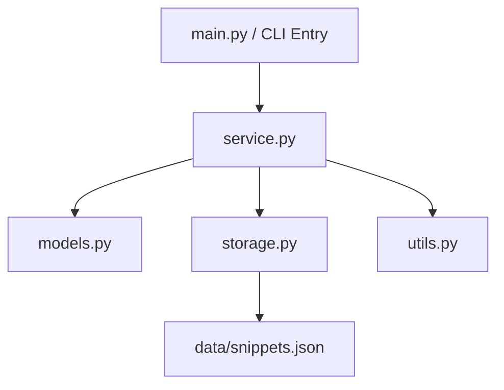
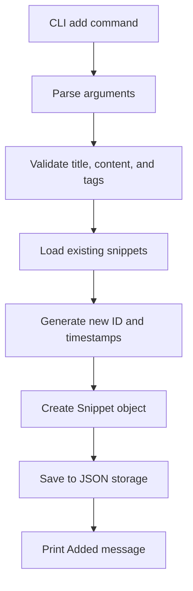

# AIASE2026 HW2 — Spec-Driven Development — From v1.0 to v2.0


**Owner:** Hsin-En, Tsai  
**Course**: Generative AI Application Systems and Engineering (AIASE 2026)
**Last updated:** 2026-03-15  

---
# SDD v1.0 — Knowledge Snippet Manager

## 1. Project Overview

- **Program Name:** Knowledge Snippet Manager
- **Version:** v1.0
- **Elevator Pitch:** A command-line tool for capturing, tagging, searching, and organizing small knowledge snippets.
- **Target Users:** Students, researchers, self-learners, and engineers who want a lightweight terminal-based tool for storing useful notes and ideas.
- **Core Value:** The program enables users to quickly record small pieces of knowledge and retrieve them efficiently through keyword search and tag-based filtering.

### Design Goal

Version 1.0 is intentionally designed as a stable and extensible CLI foundation. The goal is to provide a complete snippet management workflow while preserving clear module boundaries so that future upgrades—such as database migration, richer terminal UI, export features, or improved search logic—can be implemented with minimal changes to the existing command interface.

---

## 2. CLI Interface Specification

### General Invocation

```bash
python main.py <command> [options]
```

### Supported Commands

| Command | Arguments | Description | Example |
|---|---|---|---|
| `add` | `--title TEXT --content TEXT --tags TEXT` | Add a new snippet | `python main.py add --title "Python" --content "Decorator" --tags "programming,python"` |
| `list` | none | List all snippets | `python main.py list` |
| `show` | `--id INT` | Show one snippet by ID | `python main.py show --id 1` |
| `search` | `--query TEXT` | Search snippets by keyword in title or content | `python main.py search --query "Decorator"` |
| `filter` | `--tag TEXT` | Filter snippets by tag | `python main.py filter --tag "python"` |
| `delete` | `--id INT` | Delete one snippet by ID | `python main.py delete --id 1` |

### Command Behavior Rules

#### `add`
- Creates a new snippet with an auto-incremented integer ID.
- `title` and `content` are required and must not be empty.
- `tags` is required as an input argument in v1.0.
- The `--tags` value is a comma-separated string, for example: `python,ai,study`.
- Tags must be parsed into a list of strings.
- Leading and trailing spaces around each tag must be removed.
- Empty tags must be ignored.
- Tag matching in v1.0 is case-insensitive.

#### `list`
- Prints all stored snippets in insertion order.
- Each snippet must be displayed in a stable one-line summary format.
- If no snippets exist, the program prints `No snippets found`.

#### `show`
- Prints the full detail of one snippet.
- If the specified ID does not exist, the program prints `Error: snippet not found`.

#### `search`
- Performs case-insensitive substring matching on both `title` and `content`.
- Search results are returned in insertion order.
- If no match is found, the program prints `No matching snippets found`.
- Search in v1.0 only applies to `title` and `content`; it does not search tags.
- Search results are not ranked in v1.0.
- If multiple snippets match, all matching snippets must be returned.

#### `filter`
- Returns snippets whose tag list contains the specified tag.
- Tag comparison is case-insensitive.
- Results are returned in insertion order.
- If no match is found, the program prints `No matching snippets found`.

#### `delete`
- Removes the snippet with the given ID.
- If the specified ID does not exist, the program prints `Error: snippet not found`.

### Output Format Contract

To preserve backward compatibility, v1.0 defines the following stable output patterns:

#### Add Output
```text
Added: [1] Python
```

#### Delete Output
```text
Deleted: [1] Python
```

#### List Output
```text
[1] Python | Tags: programming, python
[2] SQL Basics | Tags: database, sql
```

#### Show Output
```text
ID: 1
Title: Python
Content: Decorator
Tags: programming, python
Created At: 2026-03-15T10:00:00
Updated At: 2026-03-15T10:00:00
```

#### Search / Filter Output
- Matching results must follow the same one-line summary format used by `list`.

These output patterns are part of the v1.0 CLI contract and should remain backward-compatible in future versions.

### CLI Compatibility Rules

- All command names defined in v1.0 are compatibility-sensitive and must remain valid in future versions.
- All required arguments defined in v1.0 must remain accepted in future versions.
- Stable observable output keywords such as `Added:`, `Deleted:`, `Error: snippet not found`, `No snippets found`, and `No matching snippets found` are considered part of the v1.0 CLI contract.
- Future versions may add optional arguments or additional output lines only if the original v1.0 command behavior remains backward-compatible.

---

## 3. Data Model

### Snippet

| Field | Type | Description | Required |
|---|---|---|---|
| `id` | `int` | Unique identifier, auto-incremented | Yes |
| `title` | `str` | Short title of the snippet | Yes |
| `content` | `str` | Main text content of the snippet | Yes |
| `tags` | `list[str]` | List of tags for categorization | Yes |
| `created_at` | `str` | Creation timestamp in ISO 8601 format | Yes |
| `updated_at` | `str` | Last update timestamp in ISO 8601 format | Yes |
| `metadata` | `dict` | Reserved field for future extension | No |

### Data Rules

- `id` must be unique.
- IDs must not be reused after deletion.
- A new ID must always be assigned as the current maximum ID plus 1.
- `title` must not be an empty string.
- `content` must not be an empty string.
- `tags` may be an empty list only if the input parsing results in no valid tag after trimming; however, the CLI still requires the `--tags` argument in v1.0.
- `created_at` and `updated_at` must use ISO 8601 string format.
- `metadata` should default to an empty dictionary `{}` in v1.0.

### Data Invariants

- Every stored snippet must contain all required fields defined in the `Snippet` model.
- `title` and `content` must remain strings after loading from storage.
- `tags` must always be stored as a list of normalized strings.

### Storage Format

- All snippets are stored in a local JSON file.
- The JSON file contains a list of snippet objects.
- The storage file is the single source of truth in v1.0.
- If the storage file does not exist, the program should initialize an empty snippet list.
- If the storage file exists but cannot be parsed correctly, the program must report a storage error.

### Forward-Looking Design Note

The `metadata` field is intentionally reserved to support future extensions without requiring disruptive schema changes. Potential future uses include source information, favorite flags, scores, URLs, or ranking-related metadata.

---

## 4. Module Structure

### Planned Modules

- `main.py`: CLI entry point and argument parsing
- `models.py`: definition of the `Snippet` data structure
- `storage.py`: loading and saving snippets from/to JSON
- `service.py`: business logic for add, list, show, search, filter, and delete
- `utils.py`: helper functions such as tag parsing, timestamp generation, and output formatting

### Mermaid Diagram



### Design Rationale

The program is intentionally divided into CLI, service, data model, storage, and utility layers for the following reasons:

1. **Separation of CLI and business logic**  
   This allows the command interface to remain stable even if future versions add richer terminal UI or alternative frontends.

2. **Separation of storage and service logic**  
   This makes it easier to replace JSON storage with SQLite or another backend in future versions without rewriting command handlers.

3. **Separation of formatting utilities**  
   This helps preserve backward-compatible output while still allowing internal implementation changes.

This structure is designed to reduce refactoring cost in v2.0 and beyond.

### Core Workflow Example: Add Command



---

## 5. Error Handling

| Scenario | Expected Behavior | Exit Code |
|---|---|---|
| Snippet ID does not exist in `show` | Print `Error: snippet not found` | 1 |
| Snippet ID does not exist in `delete` | Print `Error: snippet not found` | 1 |
| Missing required arguments | Print argparse usage message | 2 |
| Storage file cannot be loaded or parsed | Print storage error message | 3 |

### Error Handling Rules

- Commands that fail due to invalid snippet ID must exit with code `1`.
- Commands that fail due to missing required CLI arguments must exit with code `2`.
- Commands that fail due to storage-related errors must exit with code `3`.

---

## 6. Test Cases

| # | Input Command | Expected Output | Pass Condition |
|---|---|---|---|
| 1 | `python main.py add --title "Python" --content "Decorator" --tags "programming,python"` | `Added: [1] Python` | stdout contains `Added: [1] Python` and exit code = 0 |
| 2 | `python main.py list` | One-line summary of snippet 1 | stdout contains `[1] Python` and exit code = 0 |
| 3 | `python main.py show --id 1` | Full snippet detail for snippet 1 | stdout contains `ID: 1` and `Title: Python` and exit code = 0 |
| 4 | `python main.py search --query "Decorator"` | Matching result containing `Python` | stdout contains `Python` and exit code = 0 |
| 5 | `python main.py filter --tag "python"` | Matching result containing `Python` | stdout contains `Python` and exit code = 0 |
| 6 | `python main.py delete --id 1` | `Deleted: [1] Python` | stdout contains `Deleted: [1] Python` and exit code = 0 |
| 7 | `python main.py show --id 999` | `Error: snippet not found` | stderr or output contains `Error: snippet not found` and exit code = 1 |
| 8 | `python main.py add --title "Python"` | argparse usage message | exit code = 2 |


### Test Case Notes

- Test cases are designed to validate the stable CLI contract of v1.0.
- Future versions must continue to support these commands and their expected observable behavior.
- Output may include additional lines in future versions only if the original expected outputs remain present and backward-compatible.

---

## 7. Scope of v1.0

Included in v1.0:
- Add a snippet
- List snippets
- Show one snippet by ID
- Search snippets by keyword
- Filter snippets by tag
- Delete a snippet
- Store data in local JSON

Not included in v1.0:
- Edit/update command
- Database backend
- Export feature
- Rich terminal UI

These features are intentionally excluded from v1.0 to preserve a stable baseline and reduce the risk of premature architectural coupling.

### Version Strategy

The v1.0 architecture is intentionally conservative and modular. It aims to maximize future extensibility while minimizing the risk of breaking existing commands. This version serves as a stable baseline for future requirement expansion.
