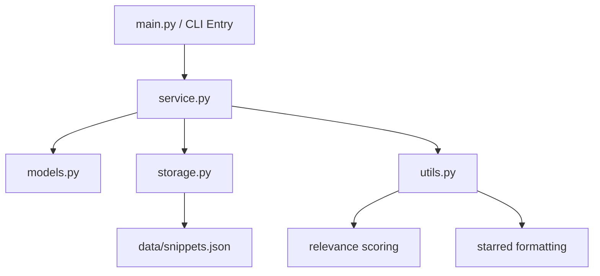
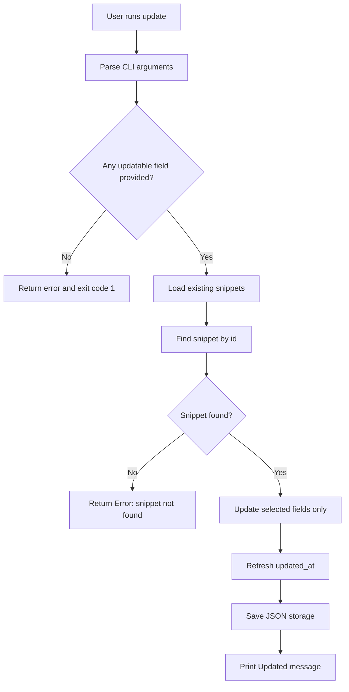

# AIASE2026 HW2 — Spec-Driven Development — From v1.0 to v2.0

**Owner:** Hsin-En, Tsai  
**Course**: Generative AI Application Systems and Engineering (AIASE 2026)  
**Last updated:** 2026-03-22  

---

# SDD v2.0 — Knowledge Snippet Manager

## 1. Project Overview

- **Program Name:** Knowledge Snippet Manager
- **Version:** v2.0
- **Elevator Pitch:** A command-line tool for capturing, tagging, searching, updating, and organizing small knowledge snippets.
- **Target Users:** Students, researchers, self-learners, and engineers who want a lightweight terminal-based tool for storing useful notes and ideas.
- **Core Value:** The program enables users to record knowledge snippets, revise them later, search more effectively, and mark important notes for fast review.

### Design Goal

Version 2.0 extends the stable v1.0 CLI baseline without breaking existing commands. The design goal is to keep the original command contract intact while introducing three practical capabilities: partial update, relevance-based search sorting, and persistent starred snippets. The implementation should preserve the modular structure of v1.0 so that future upgrades can still be added with minimal refactoring.

### v2.0 Scope Summary

Compared with v1.0, version 2.0 adds:

- `update` command for partial modification of existing snippets
- `search --sort relevance` for ranked search results
- `star` command for toggling important snippets
- `starred` command for listing only starred snippets
- `list --sort updated` for update-time-based ordering

The design intentionally keeps JSON storage and the original module boundaries to minimize architecture changes.

---

## 2. CLI Interface Specification

### General Invocation

```bash
python main.py <command> [options]
```

### Supported Commands

| Command | Arguments | Description | Example |
|---|---|---|---|
| `add` | `--title TEXT --content TEXT --tags TEXT` | Add a new snippet | `python main.py add --title "Python" --content "Decorator" --tags "programming,python"` |
| `list` | `--sort {created,updated}` *(optional)* | List all snippets | `python main.py list --sort updated` |
| `show` | `--id INT` | Show one snippet by ID | `python main.py show --id 1` |
| `search` | `--query TEXT [--sort relevance]` | Search snippets by keyword in title or content | `python main.py search --query "python" --sort relevance` |
| `filter` | `--tag TEXT` | Filter snippets by tag | `python main.py filter --tag "python"` |
| `delete` | `--id INT` | Delete one snippet by ID | `python main.py delete --id 1` |
| `update` | `--id INT [--title TEXT] [--content TEXT] [--tags TEXT]` | Partially update one snippet | `python main.py update --id 1 --title "Python Advanced"` |
| `star` | `--id INT` | Toggle starred state of one snippet | `python main.py star --id 1` |
| `starred` | none | List all starred snippets | `python main.py starred` |

### Command Behavior Rules

#### `add`
- Behavior remains identical to v1.0.
- Creates a new snippet with auto-incremented integer ID.
- `title` and `content` are required and must not be empty.
- `tags` remains a required comma-separated argument.

#### `list`
- When `--sort` is not provided, behavior must remain identical to v1.0.
- Default order is insertion order, which is treated as `created` order.
- `--sort created` produces the same observable order as v1.0.
- `--sort updated` sorts snippets by `updated_at` descending, so the most recently updated snippet appears first.
- If no snippets exist, the program prints `No snippets found`.

#### `show`
- Prints the full detail of one snippet.
- If the specified ID does not exist, the program prints `Error: snippet not found`.
- Behavior and output format remain identical to v1.0.

#### `search`
- Performs case-insensitive substring matching on both `title` and `content`.
- Search still does not search tags.
- When `--sort` is not provided, results remain in insertion order exactly as in v1.0.
- When `--sort relevance` is provided, results are sorted by relevance score from high to low.
- If no match is found, the program prints `No matching snippets found`.

#### `filter`
- Behavior remains identical to v1.0.
- Returns snippets whose tag list contains the specified tag.
- Tag comparison is case-insensitive.
- Results are returned in insertion order.

#### `delete`
- Behavior remains identical to v1.0.
- Removes the snippet with the given ID.
- If the specified ID does not exist, the program prints `Error: snippet not found`.

#### `update`
- `--id` is required.
- `--title`, `--content`, and `--tags` are optional.
- At least one of the three updatable fields must be provided.
- Any field not provided must preserve its previous value.
- On success, `updated_at` must be refreshed to the current timestamp.
- `id` and `created_at` must never be modified.
- If the specified ID does not exist, the program prints `Error: snippet not found`.
- If no updatable field is provided, the program prints `Error: at least one field to update must be provided`.

#### `star`
- `--id` is required.
- Toggles the starred state of a snippet.
- First execution sets the snippet to starred.
- Second execution on the same snippet removes the starred state.
- If the specified ID does not exist, the program prints `Error: snippet not found`.
- Star toggling is persisted in storage.
- Star toggling does **not** update `updated_at`; this field is reserved for content edits.

#### `starred`
- Lists only snippets whose starred state is enabled.
- Output format must follow the same one-line summary format as `list`.
- If no starred snippets exist, the program prints `No snippets found`.

### Output Format Contract

To preserve backward compatibility, all v1.0 keywords and base output patterns remain valid.

#### Add Output
```text
Added: [1] Python
```

#### Delete Output
```text
Deleted: [1] Python
```

#### Update Output
```text
Updated: [1] Python Advanced
```

#### Star Output
```text
Starred: [1] Python
Unstarred: [1] Python
```

#### List Output
```text
[1] Python | Tags: programming, python
[2] SQL Basics ★ | Tags: database, sql
```

#### Search / Filter Output
```text
[1] Python | Tags: programming, python
[2] SQL Basics | Tags: database, sql
```

#### Starred Output
```text
[2] SQL Basics ★ | Tags: database, sql
```

Design note:
- v2.0 adds a minimal visual marker `★` only in `list` and `starred`.
- `search` and `filter` preserve the original v1.0 one-line summary format without the marker.
- This keeps the v1.0 summary structure intact while satisfying the new starred requirement.

#### Show Output
```text
ID: 1
Title: Python
Content: Decorator
Tags: programming, python
Created At: 2026-03-15T10:00:00Z
Updated At: 2026-03-15T10:00:00Z
```

### Relevance Scoring Design

The `search --sort relevance` feature uses an explainable scoring rule:

- each occurrence of the query in the **title** contributes **3 points**
- each occurrence of the query in the **content** contributes **1 point**
- matching is case-insensitive
- snippets with the same score preserve their original insertion order

Rationale:
- title matches usually reflect stronger semantic intent than content matches
- occurrence counting is simple, transparent, and easy to maintain
- stable tie-breaking avoids surprising output changes

### CLI Compatibility Rules

- All command names defined in v1.0 remain valid in v2.0.
- All required arguments defined in v1.0 remain accepted in v2.0.
- When new optional arguments are not used, the behavior of `add`, `show`, `search`, `filter`, and `delete` remains backward-compatible. `list` preserves the same insertion order and base summary structure, with the only deliberate visible extension being the `★` marker for starred snippets.
- Stable observable keywords such as `Added:`, `Deleted:`, `Error: snippet not found`, `No snippets found`, and `No matching snippets found` remain part of the CLI contract.

---

## 3. Data Model

### Snippet

| Field | Type | Description | Required |
|---|---|---|---|
| `id` | `int` | Unique identifier, auto-incremented | Yes |
| `title` | `str` | Short title of the snippet | Yes |
| `content` | `str` | Main text content of the snippet | Yes |
| `tags` | `list[str]` | List of tags for categorization | Yes |
| `created_at` | `str` | Creation timestamp in ISO 8601 format | Yes |
| `updated_at` | `str` | Last content update timestamp in ISO 8601 format | Yes |
| `metadata` | `dict` | Reserved extension field | No |

### v2.0 Metadata Extension

The starred state is stored in `metadata`:

| Metadata Key | Type | Description | Default |
|---|---|---|---|
| `starred` | `bool` | Whether the snippet is marked as important | `False` |

Example:

```json
{
  "id": 2,
  "title": "SQL Basics",
  "content": "JOIN and GROUP BY",
  "tags": ["database", "sql"],
  "created_at": "2026-03-15T10:00:00Z",
  "updated_at": "2026-03-22T12:30:00Z",
  "metadata": {
    "starred": true
  }
}
```

### Data Rules

- `id` must be unique.
- IDs must not be reused after deletion.
- A new ID must always be assigned as the current maximum ID plus 1.
- `title` must not be an empty string.
- `content` must not be an empty string.
- `tags` must always be stored as a normalized list of lowercase strings.
- `created_at` and `updated_at` must use ISO 8601 string format.
- `metadata` must default to `{}` if missing.
- Missing `metadata.starred` must be interpreted as `False`.

### Data Invariants

- Every stored snippet must contain all required fields defined in the `Snippet` model.
- `title` and `content` must remain strings after loading from storage.
- `tags` must always be stored as a list of normalized strings.
- Existing v1.0 JSON data without `metadata.starred` must remain loadable without migration.

### Storage Format

- All snippets are stored in a local JSON file.
- The JSON file contains a list of snippet objects.
- The storage file remains the single source of truth in v2.0.
- If the storage file does not exist, the program initializes an empty snippet list.
- If the storage file exists but cannot be parsed correctly, the program reports a storage error.

---

## 4. Module Structure

### Planned Modules

- `main.py`: CLI entry point and argument parsing
- `models.py`: definition of the `Snippet` data structure
- `storage.py`: loading and saving snippets from/to JSON
- `service.py`: business logic for add, list, show, search, filter, delete, update, star, and starred
- `utils.py`: helper functions for tag parsing, timestamps, output formatting, starred-state helpers, and relevance scoring

### Mermaid Diagram — Architecture Diagram



### Design Rationale

The v2.0 implementation deliberately preserves the same module boundaries as v1.0.

1. **Stable CLI entry point**  
   `main.py` only parses arguments and routes commands. This keeps CLI compatibility easy to verify.

2. **Business logic remains centralized**  
   New behaviors such as update, star toggle, and relevance ordering are added to `service.py` rather than being scattered through the CLI layer.

3. **Storage remains unchanged**  
   JSON storage is kept as-is. This minimizes architectural risk and aligns with the assignment requirement to keep changes small.

4. **Utilities absorb extension logic**  
   Formatting, metadata helpers, and relevance scoring are placed in `utils.py`, which keeps service functions concise and easier to test.

### Mermaid Diagram — Core Workflow Example

The `update` command is selected as the representative v2.0 core flow because it modifies existing data while preserving partial fields and compatibility constraints.



---

## 5. Error Handling

| Scenario | Expected Behavior | Exit Code |
|---|---|---|
| Snippet ID does not exist in `show` | Print `Error: snippet not found` | 1 |
| Snippet ID does not exist in `delete` | Print `Error: snippet not found` | 1 |
| Snippet ID does not exist in `update` | Print `Error: snippet not found` | 1 |
| Snippet ID does not exist in `star` | Print `Error: snippet not found` | 1 |
| `update` called without any updatable field | Print `Error: at least one field to update must be provided` | 1 |
| Empty query in `search` | Print `Error: query must not be empty` | 1 |
| Empty tag in `filter` | Print `Error: tag must not be empty` | 1 |
| Missing required arguments | Print argparse usage message | 2 |
| Unsupported `--sort` value | Print argparse usage message | 2 |
| Storage file cannot be loaded or parsed | Print storage error message | 3 |

### Error Handling Rules

- Commands that fail due to invalid snippet ID must exit with code `1`.
- Commands that fail due to semantic command misuse, such as calling `update` without any field, must exit with code `1`.
- Commands that fail due to missing required CLI arguments or unsupported argparse choices must exit with code `2`.
- Commands that fail due to storage-related errors must exit with code `3`.

---

## 6. Test Cases

| # | Input Command | Expected Output | Pass Condition |
|---|---|---|---|
| 1 | `python main.py add --title "Python" --content "Decorator" --tags "programming,python"` | `Added: [1] Python` | stdout contains `Added: [1] Python` and exit code = 0 |
| 2 | `python main.py list` | One-line summary of snippet 1 | stdout contains `[1] Python` and exit code = 0 |
| 3 | `python main.py show --id 1` | Full snippet detail for snippet 1 | stdout contains `ID: 1` and `Title: Python` and exit code = 0 |
| 4 | `python main.py search --query "Decorator"` | Matching result containing `Python` | stdout contains `Python` and exit code = 0 |
| 5 | `python main.py filter --tag "python"` | Matching result containing `Python` | stdout contains `Python` and exit code = 0 |
| 6 | `python main.py delete --id 1` | `Deleted: [1] Python` | stdout contains `Deleted: [1] Python` and exit code = 0 |
| 7 | `python main.py show --id 999` | `Error: snippet not found` | stderr contains `Error: snippet not found` and exit code = 1 |
| 8 | `python main.py add --title "Python"` | argparse usage message | exit code = 2 |
| 9 | `python main.py update --id 1 --title "New Title"` | `Updated: [1] New Title` | stdout contains `Updated:` and exit code = 0 |
| 10 | `python main.py update --id 1` | `Error: at least one field to update must be provided` | stderr contains the error and exit code = 1 |
| 11 | `python main.py star --id 1` | `Starred: [1] ...` | stdout contains `Starred:` and exit code = 0 |
| 12 | `python main.py starred` | list-style output of starred snippets only | stdout contains only starred snippets and exit code = 0 |
| 13 | `python main.py search --query "python" --sort relevance` | ranked results | highest-score snippet appears first |
| 14 | `python main.py list --sort updated` | update-time descending order | most recently updated snippet appears first |

### Test Case Notes

- Test cases 1–8 preserve the v1.0 baseline.
- Test cases 9–14 validate new v2.0 features.
- The existence of optional arguments must not break baseline usage.

---

## 7. Scope of v2.0

Included in v2.0:
- Add a snippet
- List snippets
- Show one snippet by ID
- Search snippets by keyword
- Filter snippets by tag
- Delete a snippet
- Update a snippet partially
- Toggle a snippet as starred / unstarred
- List starred snippets
- Sort list results by update time
- Sort search results by relevance
- Store data in local JSON

Not included in v2.0:
- Database backend
- Export feature
- Rich terminal UI
- Search over tags
- Multi-user support

### Version Strategy

Version 2.0 is an extension release, not a rewrite. The system continues to prioritize a stable CLI and minimal architecture change while adding higher-utility behaviors that users requested after v1.0.

---

## 8. Backward Compatibility Design

### Requirement Tension and Design Resolution

The v2.0 requirements create a small but important tension:

- one requirement says that starred snippets must be visibly recognizable in the `list` output
- another requirement says that the original v1.0 commands should remain unchanged when new optional arguments are not used

This design addresses that tension explicitly instead of ignoring it.
The chosen strategy is to preserve all v1.0 command names, required arguments, storage behavior, and legacy output formats wherever possible, while applying the **smallest observable change** only in the place where the new requirement explicitly demands it.

### Preserved v1.0 Interface

| v1.0 Command | v2.0 Behavior | Compatibility |
|---|---|---|
| `program add --title TEXT --content TEXT --tags TEXT` | unchanged | Fully compatible |
| `program list` | same insertion order and same base structure; only starred items gain minimal `★` marker | Compatible with minimal required extension |
| `program show --id INT` | unchanged; no starred line is added | Fully compatible |
| `program search --query TEXT` | unchanged when `--sort` is not provided; no `★` marker is shown | Fully compatible |
| `program filter --tag TEXT` | unchanged; no `★` marker is shown | Fully compatible |
| `program delete --id INT` | unchanged | Fully compatible |

### Compatibility Decision Notes

1. **Additive-only CLI extension**  
   New functionality is introduced only through new commands (`update`, `star`, `starred`) or new optional arguments (`list --sort`, `search --sort`). Existing command names and required arguments are preserved.

2. **Legacy output is preserved by default**  
   `add`, `show`, `search`, `filter`, and `delete` keep their v1.0 observable behavior when the new options are not used. In particular, `show` does not print starred state, and `search` / `filter` continue to use the original v1.0 summary format.

3. **Smallest visible change only where the new requirement explicitly demands it**  
   The `★` marker appears only in `list` and `starred`. This is a deliberate compromise to satisfy the requirement that starred snippets be visually recognizable in `list`, while avoiding broader output changes to legacy commands.

4. **`starred` follows `list` by design**  
   The new `starred` command reuses the same starred-aware summary format as `list`, because the requirements specify that `starred` output should match `list` output.

5. **Graceful handling of old data**  
   v1.0 JSON files without `metadata.starred` remain valid and are interpreted as not starred.

### Breaking Changes

No command names, required arguments, storage layout, or baseline command semantics are intentionally broken in v2.0.

The only observable extension is the `★` marker shown in `list` and `starred` for starred snippets. This extension is intentionally limited to those outputs because it is the minimum change needed to satisfy the new starred-snippet visibility requirement.

### Migration Strategy

No explicit migration script is required.

- Existing v1.0 JSON data is loaded directly.
- If a snippet lacks `metadata` or `metadata.starred`, the system creates or interprets those fields lazily during runtime.
- The starred flag is persisted automatically the first time a snippet is toggled.

---

## 9. Implementation Notes

### Minimal Architecture Change Strategy

The implementation chooses **feature extension over structural replacement**:

- `storage.py` is kept structurally unchanged; it continues to load and save JSON while remaining compatible with v1 data
- `models.py` remains valid because `metadata` already exists
- `main.py` only adds new parser branches
- `service.py` adds new command handlers and optional sorting paths
- `utils.py` gains helper functions for starred state and relevance scoring

This strategy directly aligns with the requirement that v2.0 should preserve as much of the v1.0 structure as possible.

### Generality Improvement

Although the structure remains small, v2.0 becomes more general in two ways:

- the `metadata` field now supports real extensibility through persistent flags
- sorting logic is parameterized rather than hard-coded to insertion order only

These changes prepare the system for future extensions such as pinned snippets, archived state, or additional ranking heuristics.
